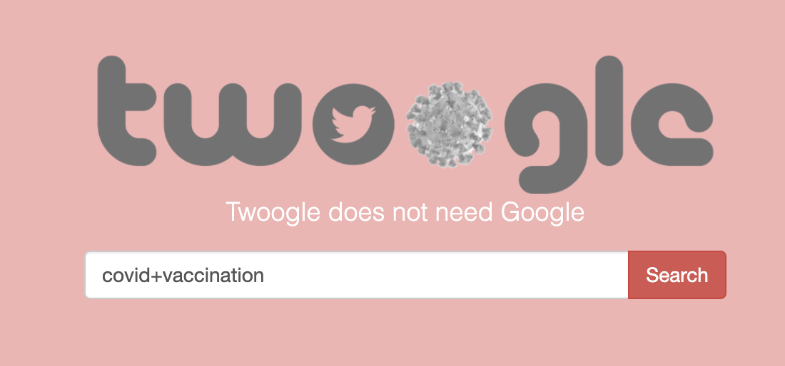

# Twoogle
Twitter **sentiment analysis** search engine to retrieve and classify real time COVID-19 vaccination tweets. Powered by DistilBERT fine-tuned on [Coronavirus Tweets Dataset](https://ieee-dataport.org/open-access/coronavirus-covid-19-tweets-dataset#files).

## Quick Start

Clone this repository:
> `git clone https://github.com/hadiqa01/Twoogle.git`

Included is a large (> 250 MB) pre-trained model binary so cloning might take a few minutes. This is the model trained on the above dataset.

Run the following commands from a **Python virtual environment**:

> 1. `pip3 install --upgrade pip`
> 2. `pip3 install -r requirements.txt`
> 3. `python3 main.py`

Then go to the following address in your browser:
> `127.0.0.1:5000/`

The webpage is a simple interface that allows you to search for **real time** tweets using a query of your choice.  
You need to explicitly concatenate a query with multiple terms:

